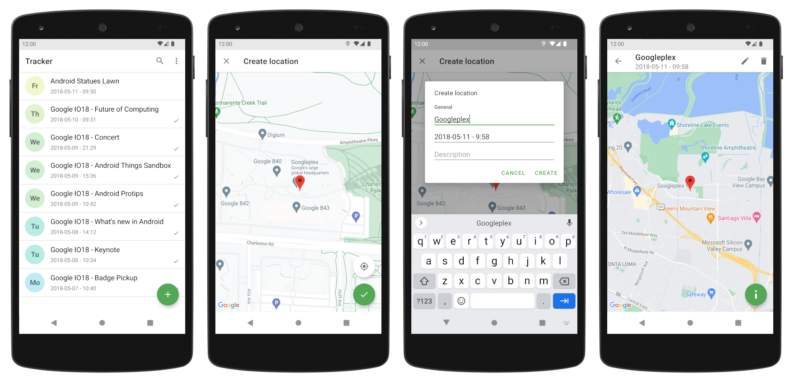

# Tracker

Tracker is a simple open source Android app to record visited places. Tracker isn't intended to
record your complete location history or record your location for a specific time. It's more like a
little diary you can use at your vacation trip. &#x1F642;

## Download 

## Features

Besides basic features like creating and editing location entries, there are following features:

- **Sync:** Sync with your self-hosted server and across your devices. The server software can be
found [here](https://github.com/mkellnhofer/tracker-server).
- **KML export:** Export all location entries as a KML file to view them with e.g. Google Earth.

## Copyright and License

Copyright Matthias Kellnhofer. All rights reserved.

Licensed under the Apache License, Version 2.0 (the "License"); you may not use this file except in
compliance with the License. You may obtain a copy of the License at

http://www.apache.org/licenses/LICENSE-2.0

Unless required by applicable law or agreed to in writing, software distributed under the License is
distributed on an "AS IS" BASIS, WITHOUT WARRANTIES OR CONDITIONS OF ANY KIND, either express or
implied. See the License for the specific language governing permissions and limitations under the
License.

Even if the source code is licensed under the Apache License, please **do not ship this app** under
your own account. Paid or free.